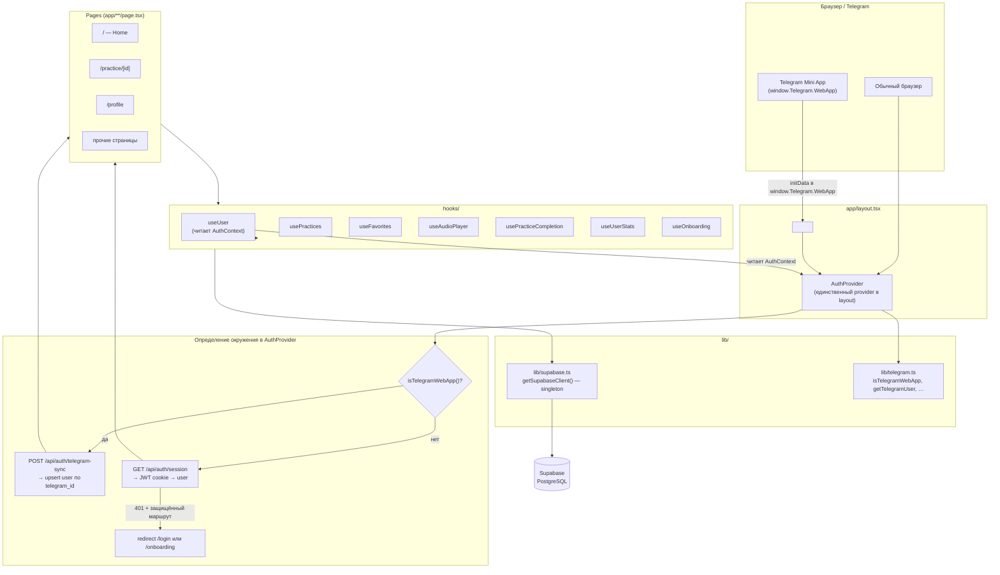

# ARCHITECTURE.md — Breathwork with BadBuddhas

---

## 1. Общая диаграмма



> **Важно:** `TelegramProvider` существует как компонент (`components/TelegramProvider.tsx`), но **не подключён в `layout.tsx`**. Инициализацию Telegram SDK выполняет `AuthProvider` напрямую через `lib/telegram.ts`. `TelegramProvider` доступен для точечного использования, но не участвует в дереве провайдеров.

---

## 2. Middleware

**Файл:** `middleware.ts`

Middleware **не защищает маршруты**. Его единственная роль:

```
Все запросы → Cache-Control: no-store, max-age=0
```

Matcher исключает `/_next/static`, `/_next/image`, `favicon.ico` и файлы со статическими расширениями.

**Защита маршрутов — полностью клиентская**, реализована в `AuthProvider`:
- при каждом изменении `pathname` вызывается `fetchUser()`
- если сессия невалидна и маршрут не в `PUBLIC_ROUTES` → `router.push('/login')` или `/onboarding`

`PUBLIC_ROUTES`: `/login`, `/register`, `/onboarding`, `/auth/`, `/forgot-password`, `/reset-password`

---

## 3. Потоки аутентификации

### 3.1 Telegram Mini App (основной flow)

```
window.Telegram.WebApp.initData (injected by Telegram)
  └→ AuthProvider.fetchUser()
       └→ isTelegramWebApp() = true
            └→ getTelegramUser() → { id, first_name, username }
                 └→ POST /api/auth/telegram-sync
                      ├→ upsert в таблицу users по telegram_id
                      ├→ обновляет first_name / username если изменились
                      └→ { user, isNewUser }
                           ├→ isNewUser && !localStorage[ONBOARDING_KEY]
                           │    └→ router.push('/onboarding')
                           └→ setUser(data.user) → AuthContext
```

Сессия хранится **только в памяти** (`useState`). При каждом открытии Mini App — повторный sync.

---

### 3.2 Браузер — Telegram Login Widget

```
/login → <Script data-telegram-login> → data-onauth callback
  └→ POST /api/auth/telegram (с hash, id, auth_date, …)
       ├→ verifyTelegramAuth() — HMAC-SHA256 через TELEGRAM_BOT_TOKEN
       ├→ проверка auth_date < 24ч
       ├→ upsert users по telegram_id
       ├→ jwt.sign({ telegram_id, user_id }, JWT_SECRET, 180d)
       └→ Set-Cookie: session=<jwt>; httpOnly; sameSite=lax
            └→ redirect /
```

Fallback (GET): `data-auth-url` redirect flow — те же шаги через query params.

---

### 3.3 Браузер — Email + Password

**Регистрация:**
```
POST /api/auth/register { email, password }
  ├→ проверка email на уникальность
  ├→ bcrypt.hash(password, 10)
  ├→ INSERT users { email, password_hash, auth_provider: 'email' }
  ├→ jwt.sign({ user_id, email }, JWT_SECRET, 180d)
  └→ Set-Cookie: session=<jwt>
```

**Вход:**
```
POST /api/auth/login { email, password }
  ├→ поиск users по email
  ├→ если user.supabase_user_id → supabase.auth.signInWithPassword()
  │    └→ проверяет email_confirmed; 401 если не подтверждён
  ├→ если только password_hash → bcrypt.compare()
  └→ jwt.sign({ user_id, email }, JWT_SECRET, 180d) → Set-Cookie
```

**Сессия:**
```
GET /api/auth/session
  ├→ cookies().get('session')
  ├→ jwt.verify(token, JWT_SECRET) → { user_id }
  └→ SELECT * FROM users WHERE id = user_id → sanitizeUser()
```

---

### 3.4 Привязка email к Telegram-аккаунту (ConnectEmailModal)

```
ProfilePage → <ConnectEmailModal telegramId={user.telegram_id}>

Шаг 1 — проверка email:
  POST /api/auth/check-email { email }
    ├→ exists=false → шаг 'new-password'
    └→ exists=true, hasPassword=true → шаг 'existing-password'

Шаг 2a — новый email:
  POST /api/auth/connect-email { telegram_id, email, password }
    ├→ supabase.auth.signUp({ email, password, data: { telegram_id } })
    │    └→ Supabase отправляет письмо подтверждения
    │       (шаблон: /auth/callback?token_hash={{ .TokenHash }}&type=signup)
    ├→ bcrypt.hash(password) → UPDATE users SET email, supabase_user_id, password_hash
    └→ шаг 'sent'

  Пользователь кликает ссылку в письме:
    GET /auth/callback?token_hash=XXX&type=signup
      ├→ supabaseSSR.auth.verifyOtp({ token_hash, type })
      ├→ UPDATE users SET email_confirmed_at = now()  WHERE telegram_id = metadata.telegram_id
      ├→ jwt.sign({ user_id, email }) → Set-Cookie: session
      └→ redirect /auth/confirm

  ProfilePage polling (каждые 5 с, пока email не подтверждён):
    GET /api/auth/email-status?telegram_id=XXX
      └→ { confirmed: true } → refreshUser()

Шаг 2b — существующий email (merge):
  POST /api/auth/merge-accounts { telegram_id, email, password }
    ├→ bcrypt.compare(password, emailUser.password_hash)
    ├→ объединение user_stats (sum practices/minutes, max streaks)
    ├→ перенос user_practices → tg user_id
    ├→ перенос favorites (без дубликатов)
    ├→ UPDATE tg user: email, password_hash, supabase_user_id, email_confirmed_at
    ├→ DELETE email-only user
    └→ шаг 'merged'
```

---

### 3.5 Восстановление пароля

```
POST /api/auth/forgot-password { email }
  ├→ поиск users по email (only если есть password_hash)
  ├→ crypto.randomBytes(32) → reset_token (1ч)
  ├→ UPDATE users SET reset_token, reset_token_expires_at
  ├→ (если RESEND_API_KEY) POST api.resend.com/emails → письмо с ссылкой
  └→ всегда 200 (no email enumeration)

/reset-password?token=XXX
  └→ POST /api/auth/reset-password { token, password }
       ├→ SELECT users WHERE reset_token = token
       ├→ проверка reset_token_expires_at
       ├→ bcrypt.hash(password)
       └→ UPDATE password_hash, reset_token=null, reset_token_expires_at=null
```

---

## 4. Компоненты и хуки

### AuthProvider (`components/AuthProvider.tsx`)

**Хранит в контексте:**
| Поле | Тип | Описание |
|---|---|---|
| `user` | `User \| null` | Текущий пользователь из БД |
| `isLoading` | `boolean` | Идёт проверка сессии |
| `isTelegram` | `boolean` | Запущено внутри Telegram Mini App |
| `logout` | `() => void` | В Telegram: `tg.close()`, в браузере: DELETE cookie + redirect |
| `refetchUser` | `() => Promise<void>` | Повторная проверка сессии |

**Зависимости:** `lib/telegram.ts`, `useRouter`, `usePathname`

**Триггер:** `useEffect([pathname])` — перепроверяет при каждом переходе между страницами.

---

### TelegramProvider (`components/TelegramProvider.tsx`)

> Не подключён в layout.tsx. Готов к использованию.

**Инжектит в контекст:**
| Поле | Тип | Описание |
|---|---|---|
| `isReady` | `boolean` | SDK инициализирован |
| `telegramId` | `number \| null` | ID пользователя из `initDataUnsafe` |

**При инициализации:** вызывает `@telegram-apps/sdk`: `init()`, `viewport.mount/expand`, `miniApp.setHeaderColor/setBackgroundColor('#000000')`, `miniApp.ready()`.

---

### ConnectEmailModal (`components/ConnectEmailModal.tsx`)

Многошаговая форма (5 шагов: `email → new-password/existing-password → sent/merged`).

**Props:** `isOpen`, `telegramId: number`, `onClose`, `onSuccess`

**Вызывает API:** `/api/auth/check-email`, `/api/auth/connect-email`, `/api/auth/merge-accounts`

**Не использует хуки** — все вызовы через `fetch` напрямую.

---

### Хуки

| Хук | Входные данные | Зависимости | Возвращает |
|---|---|---|---|
| `useUser` | — | `AuthContext` | `user, isLoading, isReady, isTelegram, logout/signOut, refetchUser/refreshUser` |
| `usePractices` | `{ category? }` | `lib/supabase`, `category` | `practices, isLoading, error, refetch` |
| `useFavorites` | — | `useUser`, `lib/supabase` | `favoriteIds, isLoading, toggleFavorite(id), isFavorite(id), refetch` |
| `useAudioPlayer` | `src: string \| null`, `{ onComplete?, onProgress? }` | `HTMLAudioElement` (ref) | `isPlaying, isLoading, currentTime, duration, progress, error, play, pause, toggle, seek, seekByPercent` |
| `usePracticeCompletion` | — | `useUser`, `lib/supabase` | `recordPractice(practiceId, listenedSeconds)` |
| `useUserStats` | — | `useUser`, `lib/supabase` | `stats: UserStats \| null, isLoading, refetch` |
| `useOnboarding` | — | `localStorage` | `isCompleted, isLoading, completeOnboarding(), resetOnboarding()` |

**Ключевая деталь `useFavorites`:** оптимистичное обновление — UI меняется немедленно, при ошибке откатывается.

**Ключевая деталь `usePracticeCompletion`:** при `diffDays === 0` стрик не меняется (одна практика в день).

---

### Страницы

| Страница | Хуки | Компоненты |
|---|---|---|
| `/` | `useUser`, `usePractices`, `useFavorites`, `useOnboarding` | `PracticeCard`, `FilterDropdown`, `Paywall` |
| `/practice/[id]` | `useAudioPlayer`, `usePracticeCompletion` | — (прямой вызов `getSupabaseClient()`) |
| `/profile` | `useUser`, `useUserStats` | `BottomSheet`, `ConnectEmailModal` (прямой вызов `createClient` для resend) |
| `/onboarding` | — | — |
| `/login` | — | Telegram Login Widget (`<Script>`) |
| `/register` | — | — |
| `/forgot-password` | — | — |
| `/reset-password` | — | — |
| `/auth/confirm` | — | — |

---

## 5. API Routes

| Метод | Путь | Что делает |
|---|---|---|
| `POST` | `/api/auth/telegram` | Telegram Login Widget: HMAC-верификация → upsert user → JWT cookie |
| `GET` | `/api/auth/telegram` | Fallback redirect flow для Login Widget (query params) |
| `POST` | `/api/auth/telegram-mini-app` | Upsert user по telegram_id (без HMAC, для Mini App) |
| `POST` | `/api/auth/telegram-sync` | Используется `AuthProvider` в Mini App: upsert + sanitized response |
| `GET` | `/api/auth/session` | Проверяет JWT cookie → возвращает user (без sensitive полей) |
| `POST` | `/api/auth/login` | Вход email/password (Supabase Auth или bcrypt fallback) → JWT cookie |
| `POST` | `/api/auth/register` | Регистрация email/password → bcrypt hash → JWT cookie |
| `POST` | `/api/auth/logout` | Удаляет cookie `session` |
| `POST` | `/api/auth/forgot-password` | Генерирует reset_token → письмо через Resend (если ключ есть) |
| `POST` | `/api/auth/reset-password` | Применяет новый пароль по reset_token |
| `POST` | `/api/auth/connect-email` | signUp в Supabase Auth → письмо подтверждения → сохраняет email + password_hash |
| `POST` | `/api/auth/check-email` | Проверяет, существует ли email и есть ли у него пароль |
| `GET` | `/api/auth/email-status` | Polling статуса подтверждения email по `telegram_id` |
| `POST` | `/api/auth/merge-accounts` | Объединяет email-аккаунт с Telegram-аккаунтом (stats + practices + favorites) |
| `GET` | `/auth/callback` | Supabase email callback: PKCE (`exchangeCodeForSession`) или token_hash (`verifyOtp`) → JWT cookie |

---

## 6. Схема базы данных (таблицы)

| Таблица | Назначение |
|---|---|
| `users` | Пользователи. Поля: `id`, `telegram_id`, `email`, `password_hash`, `supabase_user_id`, `email_confirmed_at`, `reset_token`, `reset_token_expires_at`, `first_name`, `username`, `is_premium`, `auth_provider` |
| `practices` | Аудио-практики. Поля: `id`, `title`, `title_ru`, `category`, `language`, `is_premium`, `audio_url`, `preview_image_url`, `instructor_name`, `instructor_avatar_url`, `duration_seconds`, `sort_order` |
| `user_practices` | История прослушиваний: `user_id`, `practice_id`, `listened_seconds`, `created_at` |
| `user_stats` | Агрегированная статистика: `user_id`, `current_streak`, `longest_streak`, `total_practices`, `total_minutes`, `last_practice_date`, `streak_lives` |
| `favorites` | Избранные практики: `user_id`, `practice_id` |

Миграции: `supabase/migrations/001_…` → `009_…`. Следующий номер: **010**.
